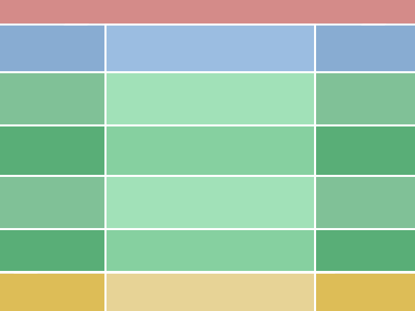

# Child Maintenance
## A custom WordPress child theme

**Child theme that works in conjunction with [Parental Guidance](https://github.com/Pezzab/childmaintenance) - a Bootstrap and Hybrid based DIY theme framework**

## Instructions

1. Download [Child Maintenance](https://github.com/Pezzab/childmaintenance) and do a search and replace against `childmaintenance` and `Child Maintenance` to insert your own theme name (don't forget to change the folder name)
2. Install [Parental Guidance](https://github.com/Pezzab/parentalguidance) and your newly edited child theme in `/wp-content/themes` and activate your child theme
3. Do all your Bootstrap editing using the files in `/mychild-less` or do your own thing. Import and compile your LESS files in `style.less` which will output to style.css
4. Use `Gruntfile.js` to handle and concatenate all your js scripts as required
5. RE template files: the idea is to avoid having to mess about with your site structure as much as possible. If you need to customise content just alter `content.php`, `content-page.php` etc. or create your own custom version (e.g. for custom post types) and an if statement or two. Ideally you only need to play around with content loops. Creating a custom template layout is for more complex needs.

## Layout

For styling the theme offers three possibilities:

* Regular 2 column centred
* 3 column centred
* Full width single column (main content still centred but you have the option to style posts individually right across the screen)

 